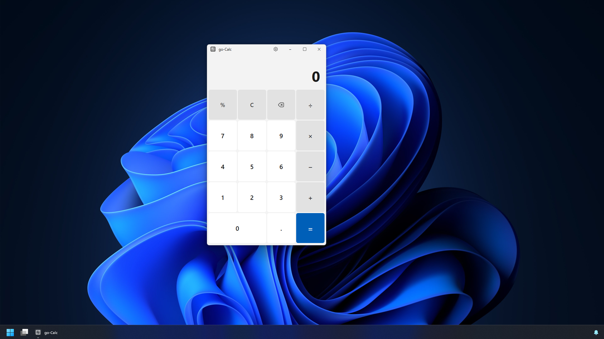
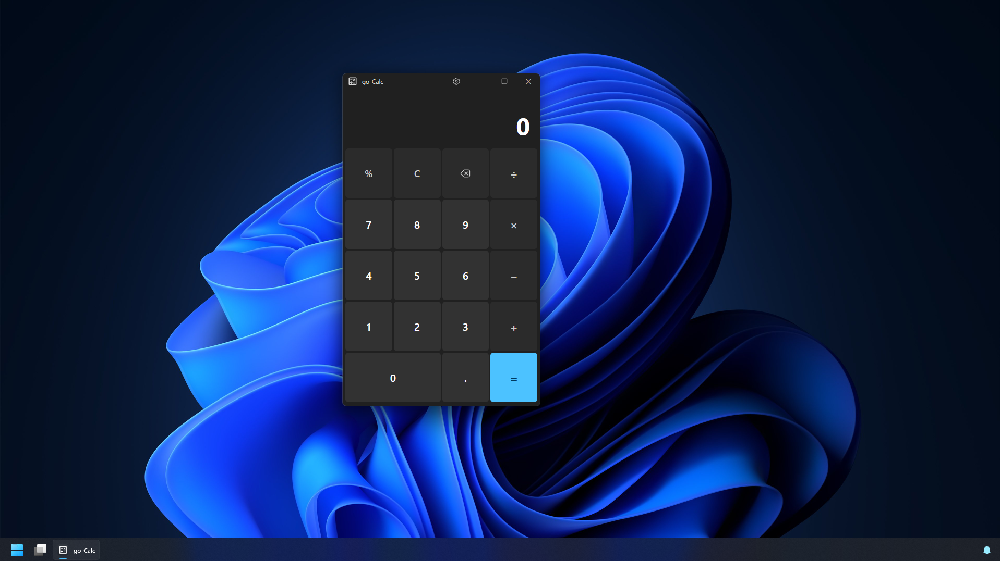
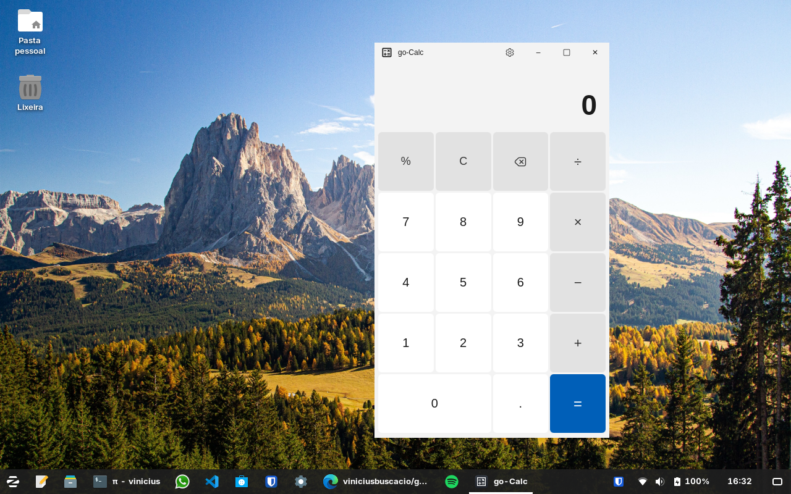
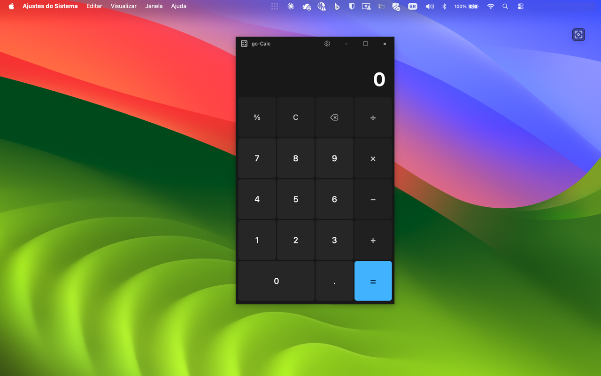

# go-Calc

**A Windows 11-style calculator that an AI agent can fully operate — and a template for building more of them.**

<table>
  <tr>
    <td width="50%" align="center">
      <br>
      <em>Running on Windows 11 — Light Mode</em>
    </td>
    <td width="50%" align="center">
      <br>
      <em>Running on Windows 11 — Dark Mode</em>
    </td>
  </tr>
  <tr>
    <td width="50%" align="center">
      <br>
      <em>Running on Linux (Zorin OS / GNOME)</em>
    </td>
    <td width="50%" align="center">
      <br>
      <em>Running on macOS — Dark Mode</em>
    </td>
  </tr>
</table>

go-Calc is two things at once:

1. **A calculator.** A clean clone of the Windows 11 Calculator (light and dark
   themes), built with [Wails](https://wails.io) — a **Go** backend that does all
   the math and a **TypeScript + Vue 3** frontend that only paints the screen.
2. **An agent-operable desktop app template.** It ships a small, secured HTTP
   *control plane* so an AI agent can discover the app, press its **real**
   buttons, read the **real** screen, and verify behaviour end-to-end. The
   calculator is the demo; the reusable part is the architecture and the control
   plane, ready to drop into a notepad, a file explorer, or any other
   cross-platform desktop app.

The guiding rule everywhere: **TypeScript only paints the screen; all logic
lives in Go.**

---

# Download

Grab a prebuilt binary from the [**Releases**](https://github.com/viniciusbuscacio/go-calc/releases/latest) page.
Each release provides one download per platform:

### 🪟 Windows (x64)

- Download **`go-calc-vX.Y.Z-windows-amd64.zip`**
- Unzip and run **`go-calc.exe`**.

### 🍏 macOS (Apple Silicon / arm64)

- Download **`go-calc-vX.Y.Z-macos-arm64.zip`** and unzip it.
- The app is **not notarized**, so macOS blocks it with *"Apple could not verify go-Calc is
  free of malware."* Run this once in Terminal, then open the app normally:
  ```bash
  xattr -dr com.apple.quarantine ~/Downloads/go-calc.app
  ```
  (On recent macOS the *System Settings → Privacy & Security → Open Anyway* button often
  doesn't work for un-notarized apps — the command above is the reliable fix.)
- The downloaded `.zip` also contains a `README.txt` with this step.

### 🐧 Linux (x64)

- Download **`go-calc-vX.Y.Z-linux-amd64.tar.gz`**
- Extract it, then install (adds the dock icon and app-grid entry under `~/.local`):
  ```bash
  tar -xzf go-calc-vX.Y.Z-linux-amd64.tar.gz
  cd go-calc && ./scripts/install-linux.sh
  ```
- Requires WebKitGTK 4.1 at runtime: `sudo apt install libwebkit2gtk-4.1-0` (Debian/Ubuntu/Zorin).

Or build it yourself — see [Development](#development).

---

# Technologies

- **Go** (backend) — the calculator engine (`math/big` for exact arithmetic), settings persistence, and the REST control plane (`net/http`).
- **TypeScript + Vue 3** (frontend) — `<script setup>` components built with Vite; the UI only paints the screen.
- **Wails v2** — packages Go and a native webview into a single cross-platform desktop binary (frameless window, Go↔JS bridge).
- **CSS** — Windows 11 / Fluent-style theming (light + dark) with Fluent System Icons.
- **Tooling** — `vue-tsc` typecheck, a Go-based cross-platform builder (`tools/build`), a Python end-to-end smoke test, and GitHub Actions CI building for Windows, Linux and macOS.

---

# FAQ
Q: Was it vibe coded?<br>
A: Yes.

Q: What's the point?<br>
A: The project goes beyond the calculator: it doubles as a template (mini-framework) for other cross-platform desktop apps in Go (Windows / Linux / macOS) — a notepad, a file explorer, etc. — sharing the same architecture.

Q: Why put a REST API server in a simple calculator?<br>
A: So an AI agent can connect and test the whole app — not just the math, but the actual UI. It reads the accessibility tree (/v1/ax) to learn where to click, then presses the real buttons and reads the screen back (/v1/ui/*). It's deliberately overkill for a calculator; the point is a reusable base for more advanced desktop apps.

Q: Which platforms does it run on?<br>
A: Windows, Linux and macOS.

## As a calculator

- Digits, decimal point, `+ − × ÷`, `%`, `=`, `C`, backspace, and parentheses
  (via the keyboard).
- Builds the whole expression and evaluates only on **`=`** / **Enter**, so
  operator precedence is respected: `2 + 3 × 4 = 14`.
- **Exact arithmetic** (`math/big` rationals): integers beyond 2⁵³ and sums like
  `0.1 + 0.2` are precise, with no floating-point noise.
- **Settings** (gear in the title bar): light/dark theme, window transparency,
  and a link to the project.

### Keyboard

| Key | Action |
| --- | --- |
| `0`–`9` `.` `,` | digits / decimal |
| `+ - * / %` | operators |
| `(` `)` | parentheses |
| `Enter` / `=` | evaluate |
| `Backspace` | delete |
| `Esc` | clear |

## As an agent-operable desktop app template

The app embeds an HTTP control plane (off by default, started from **Settings →
REST API Server**) guarded by an **API key** (`X-API-Key`) and an **IP
allowlist** (CIDR). An agent gets in through one document and drives everything
from there:

- **`GET /v1/ax`** — a machine-readable descriptor: what the app is, how to use
  it, the error contract, and an **accessibility tree** listing every view and
  control with its `role`, `testid`, `action`, keyboard shortcut and **risk
  level**. This is the agent's map.
- **`POST /v1/calc`** — compute directly through the engine.
- **`POST /v1/ui/press | key | input`** and **`GET /v1/ui/state`** — operate the
  *actual* UI: click a control by `testid`, send a key, type into a field, and
  read the resulting on-screen state back.

```bash
# 1. learn the app (start here)
curl -H "X-API-Key: YOUR_KEY" http://127.0.0.1:8737/v1/ax

# 2. compute directly
curl -X POST http://127.0.0.1:8737/v1/calc \
  -H "X-API-Key: YOUR_KEY" -d '{"expression":"200 * 50%"}'   # {"result":"100"}

# 3. ...or drive the real UI: press 7 × 6 = and read the display back
curl -X POST http://127.0.0.1:8737/v1/ui/press -H "X-API-Key: YOUR_KEY" -d '{"testid":"key-7"}'
curl -X POST http://127.0.0.1:8737/v1/ui/key   -H "X-API-Key: YOUR_KEY" -d '{"key":"*"}'
curl -X POST http://127.0.0.1:8737/v1/ui/press -H "X-API-Key: YOUR_KEY" -d '{"testid":"key-6"}'
curl -X POST http://127.0.0.1:8737/v1/ui/key   -H "X-API-Key: YOUR_KEY" -d '{"key":"Enter"}'
# {"view":"calc","display":"42","formula":"7 × 6 =", ...}
```

Errors are **structured** — `{"error":{"code","message","status"}}` with stable
codes (`unknown_testid`, `disabled_control`, `missing_field`,
`calculation_error`, …) so a client can branch on `code` instead of parsing
prose. The server binds to `127.0.0.1` (no firewall prompt) unless the allowlist
contains a non-local IP.

**Deeper docs:**

- [`docs/architecture.md`](docs/architecture.md) — the layers and why the core
  is Wails-free.
- [`docs/agent-api.md`](docs/agent-api.md) — the full control-plane contract.
- [`docs/security.md`](docs/security.md) — the key, the allowlist, and the
  threat model.

## Project layout

```
go-calc/
├── main.go                  # Wails bootstrap (frameless window, embedded frontend)
├── app.go                   # thin adapter: exposes engine, settings and REST server
├── appinfo.go               # the /v1/ax descriptor + accessibility tree
├── uibridge.go              # drives the live frontend for /v1/ui/*
├── internal/                # pure, Wails-free Go — the reusable core
│   ├── calc/                #   arithmetic engine (math/big)
│   ├── settings/            #   preferences persisted as JSON (OS config dir)
│   └── apiserver/           #   REST server: key + IP allowlist
├── frontend/src/            # Vue 3 UI: shell, store (router), views, style tokens
└── scripts/agent-smoke.py   # end-to-end smoke test over the control plane
```

`internal/*` knows nothing about Wails or the frontend. To build the next app you
swap the engine and the views; the pattern — pure core, thin adapter, dumb UI,
same control plane — stays put.

## Development

Prerequisites: [Go](https://go.dev) 1.22+, [Node](https://nodejs.org) 18+ and
the [Wails CLI](https://wails.io/docs/gettingstarted/installation) v2.

```bash
wails dev                 # development mode with hot-reload
go run ./tools/build      # cross-platform build (one command on Win/Linux/macOS)
go run ./tools/build -test # run tests, then build
go test ./internal/...    # engine and server tests

# end-to-end: with the app open and the REST server started
python scripts/agent-smoke.py
```

> Tests live under `internal/...`. The root package embeds the built frontend
> (`//go:embed`), so `go test ./...` requires a prior `wails build`; CI tests
> `./internal/...`, which needs no frontend build.

## License

MIT
